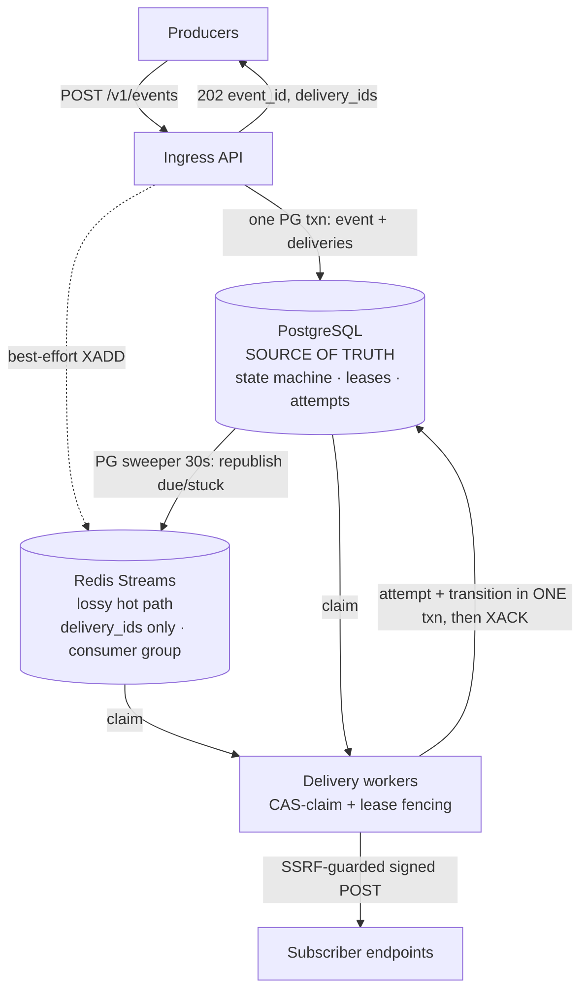

# Hookrail

[](https://github.com/mit112/hookrail/actions/workflows/ci.yml)
[](https://github.com/mit112/hookrail/releases)
[](https://github.com/mit112/hookrail/pkgs/container/hookrail)
[](https://pypi.org/project/hookrail/)
[](https://goreportcard.com/report/github.com/mit112/hookrail)
[](LICENSE)

**The self-hostable webhook delivery service you can actually reason about.**

Your app needs to POST events to your users' endpoints — and keep POSTing when
those endpoints time out, 500, or vanish for an hour. Hookrail is the piece that
sits between your app and the internet and makes that reliable: you `POST` an
event, and Hookrail guarantees **at-least-once** delivery with retries,
exponential backoff, HMAC signing, idempotency, dead-letter queues, and
per-endpoint rate limiting — all running on **your** infrastructure, backed by
Postgres, small enough to read end to end.

It's not the biggest webhooks platform. It's the one whose durability guarantees
are written down, chaos-tested, and honest about their limits.

<p align="center">
  
  <br><sub>The admin dashboard: succeeded deliveries, scheduled retries, and dead letters in one view. <a href="docs/demo/">▶ Watch a delivery, a retry, and a dead-letter happen live →</a></sub>
</p>

## Quickstart (2 minutes, no build)

Runs entirely from the published multi-arch images on GHCR — no Go toolchain, no
compiling. You need Docker.

```bash
curl -O https://raw.githubusercontent.com/mit112/hookrail/main/deploy/compose/quickstart.yml
export HOOKRAIL_MASTER_KEY=$(openssl rand -hex 32)   # 64 hex chars; the stack requires it
docker compose -f quickstart.yml up -d
```

Now open **<http://localhost:8085>** — the admin dashboard auto-logs you in as a
read-only viewer, and a built-in seeder is already producing traffic across a
healthy, a flaky, and a dead endpoint, so you immediately see **delivered**,
**retried-then-delivered**, and **dead-lettered** webhooks.

Want to send your own event and watch it arrive?

```bash
# mint a producer key + a subscription pointed at the bundled test receiver
docker compose -f quickstart.yml run --rm api hookrail-ctl seed   # prints producer_key + endpoint

curl -X POST localhost:8080/v1/events \
  -H "Authorization: Bearer <producer_key>" -H "Content-Type: application/json" \
  -d '{"topic":"demo.hello","payload":{"msg":"hi"}}'              # -> 202 {event_id, delivery_ids}

curl "localhost:9090/received?delivery_id=<delivery_id>"          # receipt count -> 1
```

Tear it down with `docker compose -f quickstart.yml down -v`.

> The quickstart is a deliberately minimal stack (core delivery path + dashboard,
> no observability tier). For the full stack with Grafana/Jaeger/Prometheus,
> chaos tooling, and the ability to build from source, see
> [Running the full stack](#running-the-full-stack).

## Features

- **At-least-once delivery** with a durable state machine — Postgres is the source
  of truth for every delivery obligation; loss is impossible, not just unlikely.
- **Retries with exponential backoff** — full jitter, honors `Retry-After`,
  configurable ceilings.
- **HMAC-SHA256 signing** — `hookrail-signature: t=<unix>,v1=…` with a ±5 min
  tolerance window and dual-secret rotation.
- **Idempotency** — producers dedup on send; consumers dedup on the
  `hookrail-delivery-id` header.
- **Dead-letter queue + one-click replay** — inspect and re-drive failed
  deliveries from the API or dashboard.
- **Per-endpoint rate limiting** — global (Redis token bucket) for override
  endpoints, per-replica otherwise.
- **Opt-in strict-FIFO per-key ordering** — at most one in-flight delivery per
  `(subscription, ordering_key)`, with pause-on-dead-letter, skip, and a backlog cap.
- **SSRF-hardened delivery** — DNS pinned to a validated IP, private/metadata
  ranges blocked, redirects refused, response reads capped.
- **Full observability** — Prometheus metrics, OpenTelemetry traces, curated
  Grafana boards.
- **Admin dashboard** — a React SPA behind a Go BFF that keeps the admin token
  server-side; role-based (viewer/operator/admin).
- **Typed Python SDK** — [`hookrail`](https://pypi.org/project/hookrail/) on PyPI.

## Why hookrail? (and when *not* to use it)

Reliable webhook delivery is a solved-enough problem that there are good tools in
this space. Here's an honest comparison so you can pick the right one.

| | **hookrail** | Svix (self-hosted) | Convoy | Hookdeck |
|---|---|---|---|---|
| License | **Apache-2.0** | MIT (open-core¹) | Source-available | SaaS (Outpost is OSS) |
| Language | Go | Rust | Go | Go |
| Direction | Outbound (send) | Outbound (send) | Inbound + outbound | Inbound + outbound |
| Self-host | Yes | Yes | Yes | Outpost only |
| Managed option | No | Yes | Paid | Yes |

<sub>¹ The Svix server is MIT-licensed, but some capabilities (SSO, advanced analytics, dedicated support) live in the paid tier. Details from each project's docs, mid-2026 — verify current specifics yourself.</sub>

- **Svix** is the most mature, battle-tested option, with a hosted service and
  compliance certifications (HIPAA/PCI). It's open-*core*, so the fully-featured
  product is paid. Reach for hookrail when you want a completely permissive
  (Apache-2.0), small, self-hosted engine you can read end to end.
- **Convoy** is the closest architectural sibling (Go, Postgres as source of
  truth, independently scalable workers/scheduler). It's source-available rather
  than OSI-approved open source. hookrail is Apache-2.0 and ships opt-in
  strict-FIFO per-key ordering.
- **Hookdeck** is an excellent managed platform; its open-source Outpost focuses
  on multi-destination outbound (SQS, Kafka, Pub/Sub, …). hookrail is
  self-host-first and does one thing: durable HTTP delivery you operate yourself.
- **Roll-your-own** — a queue and a retry loop look simple until you hit SSRF
  protection, a signature scheme, idempotency, dead-letter replay, ordering, and
  backpressure. hookrail is that machine, already hardened and chaos-tested.

**Don't use hookrail if** you need a managed service (use Svix/Hookdeck), inbound
webhook ingestion/normalization (use Hookdeck/Convoy), or multi-destination fan-out
to queues (use Outpost). hookrail is pre-1.0 with no compatibility guarantees yet.

## Honest semantics

At-least-once, **not** exactly-once — exactly-once over HTTP to arbitrary
endpoints is impossible. Consumers dedup on the `hookrail-delivery-id` header. No
FIFO ordering guarantee for unordered subscriptions (opt-in per-key ordering is
available — see [Ordered delivery](#ordered-delivery)). On single-node Postgres,
zero-loss claims hold while PG storage is intact (failure scope enumerated in the
[design doc](SPEC.md)).

## How it works



<sub>Two overlapping recovery layers — Redis PEL (seconds) and the PG sweeper (30s) — can both fire safely: **duplicates possible, loss impossible.** Losing Redis delays deliveries; it never drops them.</sub>

<details><summary>ASCII version</summary>

```text
 producers ──POST──► Ingress API ──one PG txn: event + deliveries──► 202
                          │ best-effort XADD
                          ▼
   PostgreSQL (SOURCE OF TRUTH)        Redis Streams (lossy hot path)
   deliveries = durable obligations    delivery_ids only · consumer group
   state machine · leases · attempts   PEL + XAUTOCLAIM
          ▲         ▲                        │
          │     PG sweeper (30s) ────────────┘ republish due/stuck (dups safe)
          │
   Delivery workers: CAS-claim → SSRF-guarded signed POST → classify
   → attempt + transition in ONE txn → XACK
```

</details>

**The core argument:** cross-store atomicity between Redis and Postgres is
impossible, so Postgres owns every delivery obligation and Redis is just a lossy
accelerator. Losing Redis *delays* deliveries (next sweep republishes); it never
loses them. Workers claim via compare-and-swap with lease takeover, so the two
overlapping recovery layers (Redis PEL seconds-scale, PG sweeper 30s-scale) can
both fire safely: duplicates possible, loss impossible.

Alongside the data path: **`hookrail-admin`** (`:8082`) is an internal CRUD /
query / DLQ-replay surface (never exposed to producers), and the **dashboard
BFF** (`:8085`) serves a browser admin UI while holding the admin token
server-side.

**Performance:** sustained **200 events/s** at **~58 ms p95** end-to-end
(ingest→consumer), **0 lost / 0 duplicate** deliveries across load tests — see the
[measured baseline](docs/baseline/2026-06-11.md) (published as measured, with the
hardware and protocol deviations documented).

## Running the full stack

The quickstart above pulls prebuilt images. To run the **complete** stack
(observability tier included) or to build from source:

```bash
git clone https://github.com/mit112/hookrail && cd hookrail
export HOOKRAIL_MASTER_KEY=$(openssl rand -hex 32)

# from published GHCR images (no Go build):
docker compose -f deploy/compose/docker-compose.yml -f deploy/compose/docker-compose.ghcr.yml up -d

# or build everything from source:
make up && make seed
```

Observability ships with the full stack: Grafana at `:3000` (curated `overview`
and `resilience` boards) · Jaeger at `:16686` · Prometheus at `:9091`. See
[docs/observability.md](docs/observability.md).

## Install

**Docker (recommended)** — multi-arch images (`linux/amd64`, `linux/arm64`) on GHCR:

```bash
docker pull ghcr.io/mit112/hookrail:latest            # all service binaries
docker pull ghcr.io/mit112/hookrail-dashboard:latest  # dashboard BFF + SPA
```

**Prebuilt binaries** — grab a tarball for your OS/arch from the
[latest release](https://github.com/mit112/hookrail/releases/latest). Covers the
backend services (`hookrail-api`, `-worker`, `-scheduler`, `-admin`, `-ctl`).

**`go install`** (needs Go — see `go.mod` for the toolchain):

```bash
go install github.com/mit112/hookrail/cmd/hookrail-api@latest
# also: hookrail-worker, hookrail-scheduler, hookrail-admin, hookrail-ctl
```

> The **dashboard** bundles a compiled SPA, so run it from the
> `ghcr.io/mit112/hookrail-dashboard` image (above) rather than `go install`.

## Producer SDK (Python)

A typed Python client is published on PyPI as
[`hookrail`](https://pypi.org/project/hookrail/). It covers the public producer
surface — send events, check delivery status, verify webhook signatures.

```bash
pip install hookrail
```

```python
from hookrail import Hookrail

with Hookrail(api_key="hk_...", base_url="https://hooks.example.com") as client:
    accepted = client.send_event("orders.created", {"order_id": "o_1", "amount": 4200})
    print("event:", accepted.event_id, "replayed:", accepted.replayed)
```

Full reference (async client, retries, signature verification):
[clients/python/README.md](clients/python/README.md).

## Ordered delivery

Subscriptions can opt into **strict-FIFO per-key ordering** by setting
`"ordered": true` at creation time (immutable after). Producers supply an
`ordering_key` via the `X-Hookrail-Ordering-Key` header or an `ordering_key` field
inside the `payload`. At most one delivery per `(subscription, ordering_key)` is
in-flight at a time; the head advances only when the current delivery reaches a
terminal state. When the head dead-letters, the whole key blocks until an operator
replays or skips it. The unordered path is unchanged.

<details><summary>Ordering tunables</summary>

| Env | Default | Description |
|-----|---------|-------------|
| `HOOKRAIL_ORDERING_KEY_MAX_LEN` | `256` | Max length of an ordering key |
| `HOOKRAIL_ORDERED_KEY_BACKLOG_MAX` | `10000` | Max pending deliveries per ordered key (cap+1 → `429 Retry-After`) |

`GET /v1/ordered-keys?blocked=true` lists every blocked key with its head delivery
id, block duration, backlog count, and oldest successor age.

</details>

## Admin API

`hookrail-admin` (`:8082`) requires `HOOKRAIL_ADMIN_TOKEN` (it refuses to boot
without one) and is never exposed to producers — in production it sits behind a
k3s NetworkPolicy. Errors use RFC 7807 `application/problem+json`.

<details><summary>Endpoints</summary>

| Method | Path | Description |
|--------|------|-------------|
| POST | `/v1/endpoints` | Create endpoint (SSRF-validated) |
| GET | `/v1/endpoints` | List endpoints (keyset-paginated) |
| GET | `/v1/endpoints/{id}` | Get endpoint |
| PATCH | `/v1/endpoints/{id}` | Partial update |
| DELETE | `/v1/endpoints/{id}` | Soft-delete (cascades subscriptions) |
| POST | `/v1/endpoints/{id}/rotate-secret` | Rotate HMAC secret (one-time plaintext return) |
| POST | `/v1/subscriptions` | Create subscription |
| GET | `/v1/subscriptions` | List subscriptions (optionally by `endpoint_id`) |
| GET | `/v1/subscriptions/{id}` | Get subscription |
| PATCH | `/v1/subscriptions/{id}` | Partial update |
| DELETE | `/v1/subscriptions/{id}` | Soft-delete (immutable after) |
| GET | `/v1/deliveries` | Browse deliveries (state/endpoint/topic/event filters) |
| GET | `/v1/deliveries/{id}` | Delivery timeline with attempt list |
| GET | `/v1/dlq` | Browse dead letters (endpoint-scoped) |
| POST | `/v1/dlq/{delivery_id}/replay` | Replay dead letter (atomic CAS, tombstone-checked) |
| POST | `/v1/deliveries/{id}/skip` | Skip a blocked ordered head → cursor advances |
| GET | `/v1/ordered-keys` | List blocked ordered keys (keyset-paginated; `?blocked=true`) |

The full HTTP contract is in [api/openapi.yaml](api/openapi.yaml).

</details>

<details><summary>Retention janitor tunables</summary>

A retention janitor runs inside `hookrail-scheduler` (one-shot:
`hookrail-ctl retention --once`), advisory-locked so only one runs at a time.

| Env | Default | Description |
|-----|---------|-------------|
| `RETENTION_EVENT_PAYLOAD_DAYS` | `30` | Age (days) at which event payloads are tombstoned |
| `RETENTION_ATTEMPT_DAYS` | `30` | Age (days) at which attempt rows are trimmed |
| `RETENTION_INTERVAL` | `1h` | Janitor loop interval |
| `RETENTION_BATCH` | `5000` | Batch size per pass |
| `RETENTION_TICK_BUDGET` | `60s` | Max wall-clock time per tick |
| `RETENTION_IDEM_HOURS` | `24h` | TTL for idempotency keys before purge |
| `RETENTION_STREAM_MAXLEN` | `100000` | Approx max Redis stream length (trim cap) |
| `RETENTION_ENABLED` | `true` | Set to `false` to disable the janitor |

</details>

## Security

Hookrail POSTs to user-supplied URLs — it is an SSRF machine without defenses, so
they're P0: HTTPS required in hosted mode; DNS resolved once, all answers validated
against blocked ranges (loopback, RFC1918, link-local incl. cloud metadata, CGNAT,
ULA), then the **validated IP is dialed directly** (no re-resolution → no
rebinding); redirects never followed; response reads capped at 64KB; split timeout
budget. Producer keys stored hashed; endpoint secrets AES-256-GCM at rest.
Signatures: `hookrail-signature: t=<unix>,v1=HMAC_SHA256(secret, t.delivery_id.body)`,
±5min tolerance, dual-secret rotation.

Found a vulnerability? Please report it privately — see
[SECURITY.md](.github/SECURITY.md).

## Deploy to production (k3s)

A single-node k3s deploy behind a Cloudflare Tunnel exposes the Ingest API and
Dashboard on public hostnames; the admin API stays `ClusterIP`-only. Postgres runs
as a CloudNativePG 3-instance synchronous-quorum cluster (zero RPO for accepted
events); Redis runs master+replica behind a 3-node Sentinel quorum. The app tier
(api/worker/scheduler/admin/dashboard) runs at N ≥ 2 replicas for zero-downtime
deploys. Secrets are created attended — nothing is committed. Multi-node k3s
(node/disk-loss tolerance) and the live tunnel cutover stay attended.

Full runbook (12 attended steps + residual risks): [docs/deploy/k3s.md](docs/deploy/k3s.md).

## Resilience (chaos-tested)

Durability guarantees are proven by an infrastructure-chaos suite that injects
real faults into the compose stack and asserts recovery against an out-of-band
oracle (receiver ledger + Postgres + the Prometheus API).

| Experiment | Fault | Guarantee |
|---|---|---|
| Worker crash | `docker kill` the worker mid-flight | claim fencing + Redis PEL recovery — no loss |
| Postgres outage | pause Postgres under load | fail-closed ingress, then drain to zero stranded |
| Redis queue loss | `FLUSHALL` + restart consumers | Postgres is source of truth — the sweeper republishes |
| Postgres failover | force-delete the CNPG primary under load | standby promoted, zero RPO for accepted events |
| Redis failover | force-delete the Redis master under load | Sentinel promotes a replica; every accepted delivery converges to `succeeded` |

Run the compose suite with `make chaos` (Docker; ~20–30 min). CI runs the first
three on every push to `main` and the failover pair against ephemeral k3d clusters.

## Honest limitations & residual risks

These are documented design trade-offs, not bugs. A few that matter most:

- **`rate_limit_rps` is global for override endpoints, per-replica otherwise** —
  non-override endpoints can reach N × the configured rate with N workers; the
  global path is cap-relaxing under failure (fail-open), never throttling below
  the cap.
- **Delivered payloads are JSON-canonicalized, not byte-preserved** — payloads are
  stored as Postgres `JSONB`, so keys may be reordered vs. what the producer sent.
  Signing stays self-consistent (Hookrail signs the exact bytes it sends), so
  verification always succeeds; only consumers expecting byte-identical passthrough
  are affected.
- **Ingest fan-out is O(active subscriptions)** — topic matching happens in-process,
  fine into the low thousands of subscriptions; beyond that it wants an indexed
  match.
- **Single Redis stream + consumer group** — Sentinel gives failover, not
  horizontal scale; beyond low-thousands ev/s this wants sharded streams.
- **k3s deploy is single-node** by default (node failure takes everything down);
  plain Kubernetes Secrets; no automated Postgres backup yet.

<details><summary>Full list (delivery semantics, scale ceilings, admin/dashboard, k3s)</summary>

### Delivery semantics

- **`rate_limit_rps` is enforced globally for override endpoints, per-replica
  otherwise.** Endpoints carrying an explicit override are capped globally across
  replicas via a shared Redis token bucket (`HOOKRAIL_GLOBAL_RATELIMIT`, on by
  default with Redis); the cap re-applies within one successful limits refresh
  after a change. Endpoints without an override use each worker's local limiter
  (MIN per-endpoint rps), so their effective rate can reach N × `rate_limit_rps`
  with N workers. The global path is cap-relaxing under failure: a limiter-command
  error falls back to the local bucket (fail-open) and Redis state loss
  reconstructs full buckets — both may briefly exceed the cap, never throttle
  below it. Tunables: `HOOKRAIL_RL_TIMEOUT_MS` (default 50ms),
  `HOOKRAIL_RL_TTL_FLOOR_S` (default 60s).
- **Delivered payloads are JSON-canonicalized, not byte-preserved.** Payloads are
  stored as Postgres `JSONB`, so the bytes delivered to a subscriber (and the
  bytes the HMAC signature covers) are the canonical re-serialization — keys may
  be reordered and insignificant whitespace dropped versus what the producer
  POSTed. Signing stays self-consistent, so signature verification always
  succeeds; only consumers that expect byte-identical passthrough are affected.
- **Secret rotation & URL cutover is eventual.** After `rotate-secret`, the old
  secret stays valid until every in-flight attempt completes or times out. The new
  secret is returned once and never stored in plaintext.
- **Pagination is best-effort.** Keyset cursors use ULIDs, not strictly monotonic
  within a millisecond, so same-tick items may occasionally be skipped or
  duplicated across pages. Suitable for browsing, not strict enumeration.
- **Ingest ↔ delete reconciliation is eventual.** A delivery created for a
  subscription deleted shortly before/after ingest may still be attempted; the
  system converges to correct exclusion.

### Scale ceilings

The measured baseline holds at modest subscription counts and a single-box
datastore. The known ceilings:

- **Ingest fan-out is O(active subscriptions).** Each event loads the active
  subscription set and topic-matches in the API process rather than in SQL, so
  ingest cost grows with total subscriptions, not just matches. Fine into the low
  thousands; beyond that it wants an indexed/materialized topic match.
- **Producer ingress rate limiting is per-replica.** The per-key ingress limiter
  is in-process, so the effective ceiling is `rate × API replica count`. Tunable
  via `HOOKRAIL_INGRESS_RATE_RPS` / `HOOKRAIL_INGRESS_BURST`.
- **Single Redis stream + consumer group.** All deliveries flow through one
  stream/group; the worker pool size is tunable (`HOOKRAIL_WORKER_POOL_SIZE`) but
  Sentinel provides failover, not horizontal scale. Beyond low-thousands ev/s this
  wants sharded streams or Redis Cluster.

### Admin & dashboard

- **Per-user accounts with roles (RBAC).** Dashboard users come from a mounted
  file mapped to `viewer < operator < admin`; the BFF enforces a per-route minimum
  role and forwards a role-matched upstream token. UI gating is cosmetic — the BFF
  and admin API are the boundary.
- **Cookie carries identity, role resolved live.** The session cookie holds only a
  signed username; the role is resolved per request from the live user file.
  Immediate global revocation is a session-key rotation.
- **`next_cursor` is forgeable.** Keyset cursors are unsigned; this reveals only
  data the user can already see (no privilege escalation), but cursor integrity is
  not guaranteed.
- **Role-token blast radius.** The BFF holds role-scoped admin tokens in memory;
  compromising it leaks access bounded to those roles. Network policy and the
  per-route allowlist limit it further.

### k3s deploy

Single-node (node failure takes everything down); Cloudflare Tunnel dependency for
public access; plain Kubernetes Secrets (base64 in etcd, no SealedSecrets/SOPS/Vault);
no producer-key hot-reload; unbounded observability retention (emptyDir); no
PodSecurity admission or automated Postgres backup. Public TLS exists via the
tunnel — *direct* in-cluster TLS / WAF is still deferred. Full list:
[docs/deploy/k3s.md](docs/deploy/k3s.md).

</details>

## Documentation

- [SPEC.md](SPEC.md) — the design doc: delivery state machine, failure scope, guarantees.
- [api/openapi.yaml](api/openapi.yaml) — the full HTTP contract.
- [docs/dashboard.md](docs/dashboard.md) — dashboard auth model and run details.
- [docs/observability.md](docs/observability.md) — metrics, traces, Grafana boards.
- [docs/deploy/k3s.md](docs/deploy/k3s.md) — the production k3s runbook.
- [docs/baseline/](docs/baseline/) — measured performance baselines.

## Roadmap & versioning

Hookrail's core (durable ingest, delivery state machine, SSRF-guarded signed
delivery, backoff, DLQ) is shipped and chaos-tested, along with the admin surface,
Python SDK, dashboard, single-node k3s HA deploy, and opt-in strict-FIFO ordering.

Next up (help wanted — see [good first issues](https://github.com/mit112/hookrail/labels/good%20first%20issue)):

- Multi-node k3s (node/disk-loss tolerance)
- Sharded Redis streams for horizontal delivery scale
- Indexed/materialized topic matching for large subscription counts
- Automated Postgres backup/restore in the deploy

The service is **pre-1.0** with no compatibility guarantees yet. The Python SDK
follows SemVer.

## Development

```bash
make test          # unit (go test -race)
make itest         # integration (needs Docker)
make e2e           # full-stack end-to-end
make lint          # golangci-lint
make chaos         # infrastructure-chaos suite (Docker; ~20-30 min)
make py-verify     # Python SDK lint + typecheck + test
make web-verify    # dashboard SPA typecheck + lint + test + build
```

Conventional commits; merges require green CI. See [CONTRIBUTING.md](CONTRIBUTING.md).

## License

Apache-2.0 — see [LICENSE](LICENSE).
