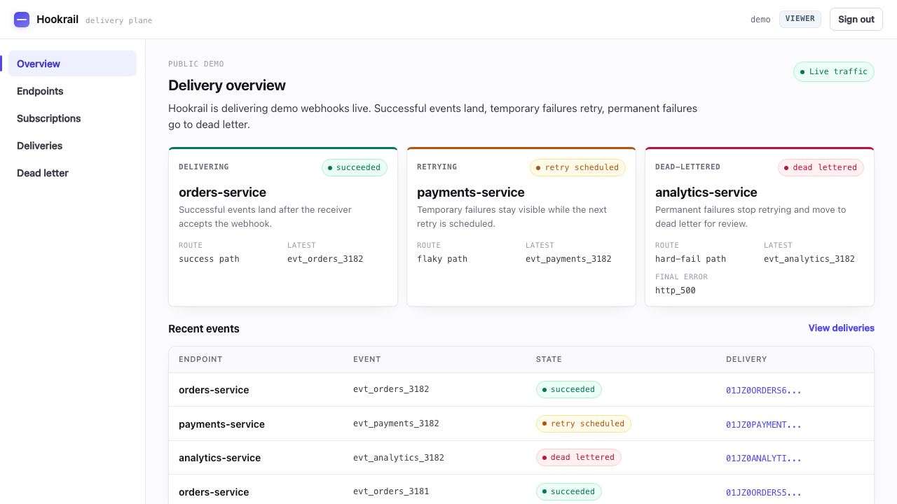
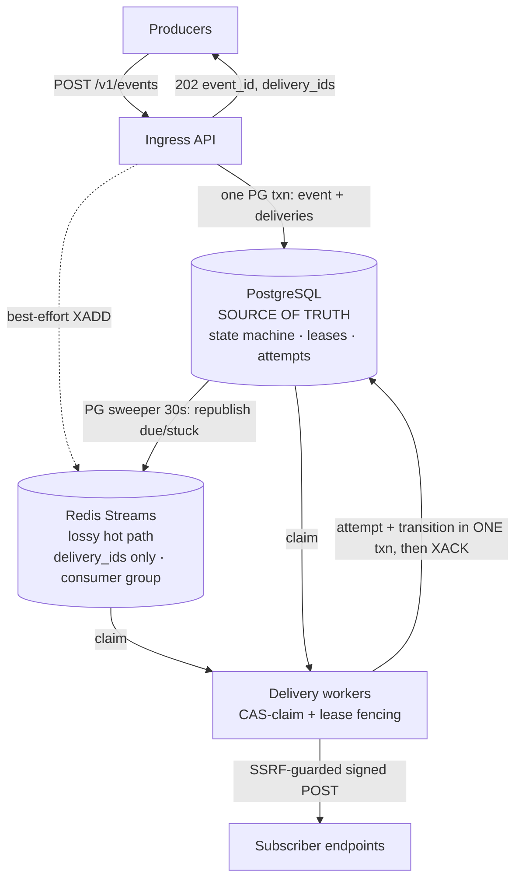

# Hookrail

[](https://github.com/mit112/hookrail/actions/workflows/ci.yml)
[](https://pypi.org/project/hookrail/)
[](LICENSE)

**Self-hostable webhook delivery service.** Producers POST events; Hookrail
guarantees at-least-once delivery to subscribed HTTP endpoints with retries,
exponential backoff (full jitter + Retry-After), idempotency, HMAC signing,
dead-letter queues, per-endpoint rate limiting, and full observability.

> **Status:** P0 core + P1 + P2 shipped — backend admin surface, Python SDK (on PyPI),
> admin dashboard, a single-node k3s deploy, the chaos + curated-Grafana suite (Slice D),
> and opt-in strict-FIFO per-key ordering (P2). The service is pre-1.0; no compatibility guarantees yet.

<p align="center">
  
  <br><sub>The public demo dashboard: succeeded deliveries, scheduled retries, and dead letters in one read-only view.</sub>
</p>

**At a glance:** sustained **200 events/s** at **~58 ms p95** end-to-end (ingest→consumer),
**0 lost / 0 duplicate** deliveries across load tests — see [baseline](docs/baseline/2026-06-11.md).

## Architecture



<sub>Two overlapping recovery layers — Redis PEL (seconds) and the PG sweeper (30s) — can both fire safely: **duplicates possible, loss impossible.** Losing Redis delays deliveries; it never drops them.</sub>

<details><summary>ASCII version</summary>

```text
 producers ──POST──► Ingress API ──one PG txn: event + deliveries──► 202
                          │ best-effort XADD
                          ▼
   PostgreSQL (SOURCE OF TRUTH)        Redis Streams (lossy hot path)
   deliveries = durable obligations    delivery_ids only · consumer group
   state machine · leases · attempts   PEL + XAUTOCLAIM
          ▲         ▲                        │
          │     PG sweeper (30s) ────────────┘ republish due/stuck (dups safe)
          │
   Delivery workers: CAS-claim → SSRF-guarded signed POST → classify
   → attempt + transition in ONE txn → XACK
```

</details>

Alongside the data path: **`hookrail-admin`** (`:8082`) is an internal CRUD /
query / DLQ-replay surface (never exposed to producers), and the **dashboard
BFF** (`:8085`) serves a browser admin UI while holding the admin token
server-side.

**The core argument:** cross-store atomicity between Redis and Postgres is
impossible, so Postgres owns every delivery obligation and Redis is just a lossy
accelerator. Losing Redis *delays* deliveries (next sweep republishes); it never
loses them. Workers claim via compare-and-swap with lease takeover, so the two
overlapping recovery layers (Redis PEL seconds-scale, PG sweeper 30s-scale) can
both fire safely: duplicates possible, loss impossible.

## Honest semantics

At-least-once, not exactly-once — exactly-once over HTTP to arbitrary endpoints is
impossible. Consumers dedup on the `hookrail-delivery-id` header. No FIFO ordering
guarantee for unordered subscriptions. Opt-in strict-FIFO per-key ordering is available (see **Ordered delivery** below). Single-node
Postgres: zero-loss claims hold while PG storage is intact (failure scope
enumerated in the design doc).

## Quickstart (60 seconds)

```bash
git clone https://github.com/mit112/hookrail && cd hookrail
export HOOKRAIL_MASTER_KEY=$(openssl rand -hex 32)   # 64 hex chars; the stack requires it
make up && make seed     # prints your producer key + endpoint secret
curl -X POST localhost:8080/v1/events \
  -H "Authorization: Bearer <producer key>" -H "Content-Type: application/json" \
  -d '{"topic":"demo.hello","payload":{"msg":"hi"}}'   # -> 202 {event_id, delivery_ids}
# watch it arrive (receipt count -> 1): curl "localhost:9090/received?delivery_id=<id>"
```

Observability ships with the stack: Grafana at `:3000` (datasource provisioned;
curated dashboards in Slice D) · Jaeger at `:16686` · Prometheus at `:9091`.
See [docs/observability.md](docs/observability.md).

## Producer SDK (Python)

A typed Python client is published on PyPI as
[`hookrail`](https://pypi.org/project/hookrail/) (0.1.0). It covers the public
producer surface — send events, check delivery status, verify webhook signatures.

```bash
pip install hookrail
```

```python
from hookrail import Hookrail

with Hookrail(api_key="hk_...", base_url="https://hooks.example.com") as client:
    accepted = client.send_event("orders.created", {"order_id": "o_1", "amount": 4200})
    print("event:", accepted.event_id, "replayed:", accepted.replayed)
```

Full reference (async client, retries, signature verification): see
[clients/python/README.md](clients/python/README.md).

## Dashboard

A browser-based admin dashboard (React/TypeScript SPA) served by a Go
backends-for-frontends (BFF) that holds the admin token server-side so it never
reaches the browser. Humans log in with a shared password and get an HMAC-signed
session cookie; the BFF proxies an allowlist of admin routes plus one test-event
route.

```bash
docker compose -f deploy/compose/docker-compose.yml up -d --build dashboard
# Open http://localhost:8085 — the image builds the SPA itself
```

Environment variables, auth model, and run details: see
[docs/dashboard.md](docs/dashboard.md).

## Admin API & retention

`hookrail-admin` listens on `:8082` and requires `HOOKRAIL_ADMIN_TOKEN` (a bearer
secret; it refuses to boot without one). It is not exposed to producers — in
production it sits behind a k3s NetworkPolicy. Every `/v1/*` route checks the
bearer token; ops routes (`/healthz`, `/readyz`, `/metrics`) are exempt. Errors
use RFC 7807 `application/problem+json`.

| Method | Path | Description |
|--------|------|-------------|
| POST | `/v1/endpoints` | Create endpoint (SSRF-validated) |
| GET | `/v1/endpoints` | List endpoints (keyset-paginated) |
| GET | `/v1/endpoints/{id}` | Get endpoint |
| PATCH | `/v1/endpoints/{id}` | Partial update |
| DELETE | `/v1/endpoints/{id}` | Soft-delete (cascades subscriptions) |
| POST | `/v1/endpoints/{id}/rotate-secret` | Rotate HMAC secret (one-time plaintext return) |
| POST | `/v1/subscriptions` | Create subscription |
| GET | `/v1/subscriptions` | List subscriptions (optionally filtered by `endpoint_id`) |
| GET | `/v1/subscriptions/{id}` | Get subscription |
| PATCH | `/v1/subscriptions/{id}` | Partial update |
| DELETE | `/v1/subscriptions/{id}` | Soft-delete (immutable after) |
| GET | `/v1/deliveries` | Browse deliveries (state/endpoint/topic/event filters) |
| GET | `/v1/deliveries/{id}` | Delivery timeline with attempt list |
| GET | `/v1/dlq` | Browse dead letters (endpoint-scoped) |
| POST | `/v1/dlq/{delivery_id}/replay` | Replay dead letter (atomic CAS, tombstone-checked) |
| POST | `/v1/deliveries/{id}/skip` | Skip a blocked ordered head → cursor advances |
| GET | `/v1/ordered-keys` | List blocked ordered keys (keyset-paginated; `?blocked=true`) |

A retention janitor runs inside `hookrail-scheduler` (one-shot variant:
`hookrail-ctl retention --once`). It purges idempotency keys, tombstones old event
payloads, and trims old delivery attempts, advisory-locked so only one runs at a
time.

| Env | Default | Description |
|-----|---------|-------------|
| `RETENTION_EVENT_PAYLOAD_DAYS` | `30` | Age (days) at which event payloads are tombstoned |
| `RETENTION_ATTEMPT_DAYS` | `30` | Age (days) at which attempt rows are trimmed |
| `RETENTION_INTERVAL` | `1h` | Janitor loop interval |
| `RETENTION_BATCH` | `5000` | Batch size per pass |
| `RETENTION_TICK_BUDGET` | `60s` | Max wall-clock time per tick |
| `RETENTION_IDEM_HOURS` | `24h` | TTL for idempotency keys before purge |
| `RETENTION_STREAM_MAXLEN` | `100000` | Approx max Redis stream length (trim cap) |
| `RETENTION_ENABLED` | `true` | Set to `false` to disable the janitor |

## Ordered delivery (P2)

Subscriptions can opt into **strict-FIFO per-key ordering** by setting `"ordered": true`
at creation time (immutable after creation). Producers supply an `ordering_key` via the
`X-Hookrail-Ordering-Key` header or an `ordering_key` field inside the `payload` object
(conflicting values → 400). The key is an opaque string up to `HOOKRAIL_ORDERING_KEY_MAX_LEN` characters
(default 256).

**Guarantee:** at most one delivery per `(subscription, ordering_key)` is in-flight at a
time. The head of each key advances only when the current delivery reaches a terminal
state (`succeeded`, `skipped`, or `cancelled`).

**Pause on dead-letter:** when the head dead-letters, the entire key blocks — no
successor is dispatched until an operator replays the dead-letter (existing
`POST /v1/dlq/{delivery_id}/replay`) or skips it via `POST /v1/deliveries/{id}/skip`.

**Backlog cap:** per-key, up to `HOOKRAIL_ORDERED_KEY_BACKLOG_MAX` (default 10000)
pending deliveries. The cap+1-th POST returns `429 Too Many Requests` with a
`Retry-After` header. Unordered traffic is unaffected.

**Visibility:** `GET /v1/ordered-keys?blocked=true` lists every blocked key with its
head delivery id, block duration, backlog count, and oldest successor age.

| Env | Default | Description |
|-----|---------|-------------|
| `HOOKRAIL_ORDERING_KEY_MAX_LEN` | `256` | Max length of an ordering key |
| `HOOKRAIL_ORDERED_KEY_BACKLOG_MAX` | `10000` | Max pending deliveries per ordered key |

The unordered delivery path is unchanged — a delivery with no `ordering_key` behaves
exactly as before.

## Deploy to k3s

A single-node k3s deploy behind a Cloudflare Tunnel exposes the Ingest API and
Dashboard on public hostnames; the admin API stays `ClusterIP`-only (NetworkPolicy
allows only dashboard→admin). Public TLS is terminated at the Cloudflare edge.
Secrets are created attended — nothing is committed.

Full runbook (12 attended steps + residual risks):
[docs/deploy/k3s.md](docs/deploy/k3s.md).

## Observability

Prometheus (`:9091`) scrapes the api/worker/scheduler; Grafana (`:3000`) has a
provisioned datasource and two curated boards (`overview`, `resilience`); the OTel
Collector forwards traces to Jaeger (`:16686`). Details:
[docs/observability.md](docs/observability.md).

## Resilience

Hookrail's durability guarantees are proven by an infrastructure-chaos suite that
injects real faults into the compose stack and asserts recovery against an
out-of-band oracle (the receiver ledger + Postgres + the Prometheus API).

| Experiment | Fault | Guarantee |
|---|---|---|
| Worker crash | `docker kill` the worker mid-flight | claim fencing + Redis PEL recovery — no loss |
| Postgres outage | pause Postgres under load | fail-closed ingress, then drain to zero stranded |
| Redis queue loss | `FLUSHALL` + restart consumers | Postgres is the source of truth — the PG sweeper republishes |

Run the suite locally with `make chaos` (requires Docker; ~20–30 min). CI runs all
three experiments on `main`. Validate the dashboards with `make dash-verify`. The
curated Grafana boards (`overview`, `resilience`) provision automatically with
`make up` at <http://localhost:3000>.

Two further **datastore-failover** experiments run against a live k3d cluster (their
own main-only CI jobs; `scripts/pg-failover-e2e.sh`, `scripts/redis-failover-e2e.sh`):

| Experiment | Fault | Guarantee |
|---|---|---|
| Postgres failover | force-delete the CNPG primary under load | a standby is promoted (new primary, `-rw` flips, old pod rejoins) with zero RPO for accepted events |
| Redis failover | force-delete the Redis master under load | Sentinel promotes a **different-ordinal** replica; every accepted delivery still converges to `succeeded` (RPO=0 via PG+sweeper), and a destroyed consumer group recovers in place |

## High Availability (app tier)

The relay app tier (api, worker, scheduler, admin, dashboard) runs at N ≥ 2
replicas for zero-downtime deploys and single-replica failure tolerance.

- **Scheduler leader election.** Only one scheduler replica sweeps at a time,
  elected via a Postgres session-scoped advisory lock (key `0x484b0000`) held on
  a standalone connection. Ownership is verified against `pg_locks` before each
  cycle — not just liveness. Standby schedulers serve `/metrics` and readiness
  probes but never sweep or reconcile.
- **Worker graceful drain.** On SIGTERM a worker stops consuming new deliveries
  (`XREADGROUP`), finishes in-flight HTTP attempts, then releases any remaining
  claimed deliveries to `retry_scheduled` via a fenced `claim_version` CAS. A
  reserve-before-claim tracker closes the race between a claim-in-progress and
  the drain fence, guaranteeing every straggler is released within the
  configured `HOOKRAIL_DRAIN_DEADLINE`.
- **Global rate limiting for override endpoints.** Endpoints with an explicit
  `rate_limit_rps` override are now enforced **globally** across all worker
  replicas via a shared Redis token bucket (on by default when Redis is
  configured; `HOOKRAIL_GLOBAL_RATELIMIT=0` disables). A changed override takes
  effect within one successful limits refresh (`HOOKRAIL_LIMITS_REFRESH_INTERVAL`,
  default 15s). Endpoints without an override keep the per-replica local limiter,
  whose effective rate can still reach N × `rate_limit_rps` with N workers. The
  global path is **cap-relaxing under failure**: a limiter-command error falls
  back to the per-replica bucket (fail-open) and Redis state loss reconstructs
  full buckets — both may briefly admit above the cap, never throttle below it.
- **Datastore HA (Postgres + Redis); multi-node + tunnel cutover stay attended.**
  Postgres runs as a CloudNativePG 3-instance synchronous-quorum cluster (zero RPO
  for accepted events) and Redis runs as a master+replica StatefulSet behind a
  3-node Sentinel quorum with automatic promotion. The Cloudflare Tunnel
  (`cloudflared`) is bumped to 2 replicas in the prod overlay, but the live cutover
  remains an attended procedure. On a single k3s node every HA tier is process-level
  failover only — **multi-node k3s** (node/disk-loss tolerance) is the remaining
  deferred slice.

Operational notes (PgBouncer incompatibility, drain timeout, rate-limit
disclosure): see [docs/deploy/k3s.md](docs/deploy/k3s.md).

## Security

Hookrail POSTs to user-supplied URLs — it is an SSRF machine without defenses, so
they're P0: HTTPS required in hosted mode; DNS resolved once, all answers validated
against blocked ranges (loopback, RFC1918, link-local incl. cloud metadata, CGNAT,
ULA), then the **validated IP is dialed directly** (no re-resolution → no
rebinding); redirects never followed; response reads capped at 64KB; split timeout
budget. Producer keys stored hashed; endpoint secrets AES-256-GCM at rest.
Signatures: `hookrail-signature: t=<unix>,v1=HMAC_SHA256(secret, t.delivery_id.body)`,
±5min tolerance, dual-secret rotation.

## Honest limitations & residual risks

These are documented design trade-offs, not bugs.

### Delivery semantics

- **`rate_limit_rps` is enforced globally for override endpoints, per-replica
  otherwise.** Endpoints carrying an explicit override are capped globally across
  replicas via a shared Redis token bucket (`HOOKRAIL_GLOBAL_RATELIMIT`, on by
  default with Redis); the cap re-applies within one successful limits refresh
  after a change. Endpoints without an override use each worker's local limiter
  (MIN per-endpoint rps), so their effective rate can reach N × `rate_limit_rps`
  with N workers. The global path is cap-relaxing under failure: a limiter-command
  error falls back to the local bucket (fail-open) and Redis state loss
  reconstructs full buckets — both may briefly exceed the cap, never throttle
  below it. Burst is floored at 1, so even sub-0.5 rps values eventually deliver.
  Tunables: `HOOKRAIL_RL_TIMEOUT_MS` (default 50ms), `HOOKRAIL_RL_TTL_FLOOR_S`
  (default 60s).
- **Delivered payloads are JSON-canonicalized, not byte-preserved.** Payloads
  are stored as Postgres `JSONB`, so the bytes delivered to a subscriber (and the
  bytes the HMAC signature covers) are the canonical re-serialization — keys may
  be reordered and insignificant whitespace dropped versus what the producer
  POSTed. Signing stays self-consistent (Hookrail signs exactly the bytes it
  sends), so signature verification always succeeds; only consumers that expect
  byte-identical passthrough of their original JSON are affected.
- **Secret rotation & URL cutover is eventual.** After `rotate-secret`, the old
  secret stays valid until every in-flight attempt completes or times out. The new
  secret is returned once and never stored in plaintext.
- **Pagination is best-effort.** Keyset cursors use ULIDs, not strictly monotonic
  within a millisecond, so same-tick items may occasionally be skipped or
  duplicated across pages. Suitable for browsing, not strict enumeration.
- **Ingest ↔ delete reconciliation is eventual.** A delivery created for a
  subscription deleted shortly before/after ingest may still be attempted; the
  system converges to correct exclusion.

### Scale ceilings

The measured baseline holds at modest subscription counts and a single-box
datastore. The known ceilings, before they'd need work:

- **Ingest fan-out is O(active subscriptions).** Each event loads the active
  subscription set and topic-matches in the API process rather than in SQL, so
  ingest cost grows with total subscriptions, not just matches. Fine into the
  low thousands; beyond that it wants an indexed/materialized topic match.
- **Producer ingress rate limiting is per-replica.** Like the non-override
  delivery path, the per-key ingress limiter is in-process, so the effective
  ceiling is `rate × API replica count`. Tunable via `HOOKRAIL_INGRESS_RATE_RPS`
  / `HOOKRAIL_INGRESS_BURST` (no rebuild required); a global cap would need the
  same Redis token bucket the delivery path already uses.
- **Single Redis stream + consumer group.** All deliveries flow through one
  stream/group; the worker pool size is tunable (`HOOKRAIL_WORKER_POOL_SIZE`)
  but Sentinel provides failover, not horizontal scale — the master is one node.
  Beyond low-thousands ev/s this wants sharded streams or Redis Cluster.

### Admin & dashboard

- **Per-user accounts with roles (RBAC R2).** Dashboard users come from a mounted
  file mapped to `viewer < operator < admin`; the BFF enforces a per-route minimum
  role and forwards a role-matched, attested upstream token (see
  [docs/dashboard.md](docs/dashboard.md)). UI gating is cosmetic — the BFF and
  admin API are the boundary.
- **Cookie carries identity, role resolved live.** The session cookie holds only a
  signed username; the role is resolved per request from the live user file, so
  deleting/downgrading a user takes effect on the next request after a reload.
  Immediate global revocation is a session-key rotation; a single leaked cookie
  still can't be revoked individually before its TTL.
- **`next_cursor` is forgeable.** Keyset cursors are unsigned and tamperable. This
  reveals only data the user can already see (no privilege escalation), but cursor
  integrity is not guaranteed.
- **Role-token blast radius.** The BFF holds the role-scoped admin tokens in memory;
  compromising the BFF leaks access bounded to those roles (no longer a single full-
  admin token). Network policy and the per-route allowlist limit it further.
- **Test-event key exposure.** The test-event feature injects a provisioned
  producer key into the BFF's upstream calls; a BFF compromise leaks the ability
  to produce test events.

### k3s deploy

Single-node (node failure takes everything down); Cloudflare Tunnel dependency for
public access; plain Kubernetes Secrets (base64 in etcd, no SealedSecrets/SOPS/Vault);
no producer-key hot-reload; unbounded observability retention (emptyDir); no
PodSecurity admission or automated Postgres backup. Public TLS exists via the
tunnel — *direct* in-cluster TLS / WAF is still deferred. Full list:
[docs/deploy/k3s.md](docs/deploy/k3s.md).

## Measured baseline

See [docs/baseline/](docs/baseline/) — k6 protocol, hardware, and the numbers table
(published as measured, whatever they are).

## Roadmap & versioning

- **P0** ✓ — durable ingest, delivery state machine, SSRF-guarded signed delivery,
  backoff, DLQ, measured baseline.
- **P1** — Slice A (admin surface) ✓ · Slice B (Python SDK, PyPI) ✓ · Slice C
  (dashboard) ✓ · Slice D (chaos suite + Grafana dashboards) ✓ · Slice E (k3s deploy + ops-hardening) ✓ · Slice F (docs v2) ✓.
- **P2** ✓ — opt-in strict-FIFO per-key ordering with pause-on-dead-letter, skip, backlog cap, and chaos-proven zero-reorder.

Versioning: the Python SDK follows SemVer (`hookrail` 0.1.0). The service itself is
pre-1.0 with no compatibility guarantees yet.

## Development

```bash
make test          # unit
make itest         # integration (needs Docker)
make e2e           # full-stack end-to-end
make lint          # golangci-lint
make py-verify     # Python SDK lint + typecheck + test
make web-verify    # dashboard SPA typecheck + lint + test + build
```

Conventional commits; merges require green CI.

## License

Apache-2.0 — see [LICENSE](LICENSE).
