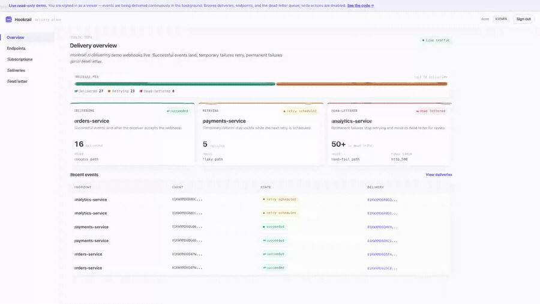

# Demo

A short loop of the admin dashboard delivering webhooks live — events landing,
transient failures retrying with backoff, and exhausted retries collecting in the
dead-letter queue.



The clip above is the first ~15 seconds of a fuller ~2-minute walkthrough that also
shows the per-delivery attempt timeline (eight attempts, every one a 500), the
dead-letter queue with final errors, and the endpoints each on a different
reliability path.

## Regenerating the GIF

The GIF is derived from the source screen recording with `ffmpeg`:

```bash
ffmpeg -ss 0 -t 15 -i hookrail-dashboard-demo-60s-60fps.mp4 \
  -filter_complex "fps=12,scale=900:-1:flags=lanczos,split[s0][s1];[s0]palettegen=stats_mode=diff[p];[s1][p]paletteuse=dither=bayer:bayer_scale=3" \
  -y docs/demo/hookrail-demo.gif
```

Adjust `-ss`/`-t` to pick a different window, or `scale`/`fps` to trade size for
smoothness.

## See it yourself

To watch the dashboard live — succeeded deliveries, scheduled retries climbing, and
dead letters accumulating — run the quickstart and open <http://localhost:8085>:

```bash
export HOOKRAIL_MASTER_KEY=$(openssl rand -hex 32)
docker compose -f deploy/compose/quickstart.yml up -d
```

It auto-logs you in as a read-only viewer, and a built-in seeder continuously
produces traffic across a healthy, a flaky, and a dead endpoint.
